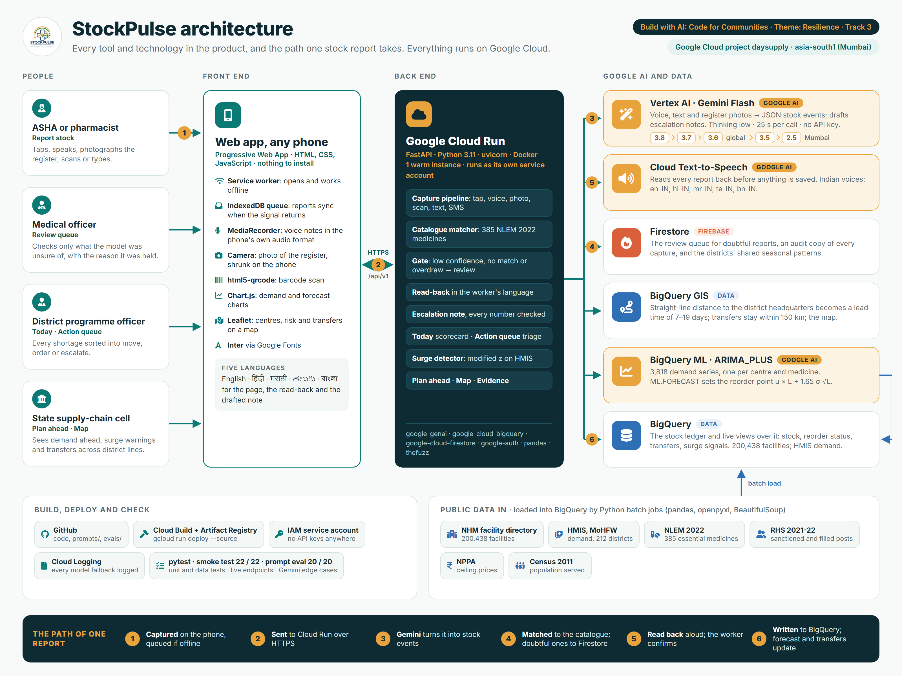
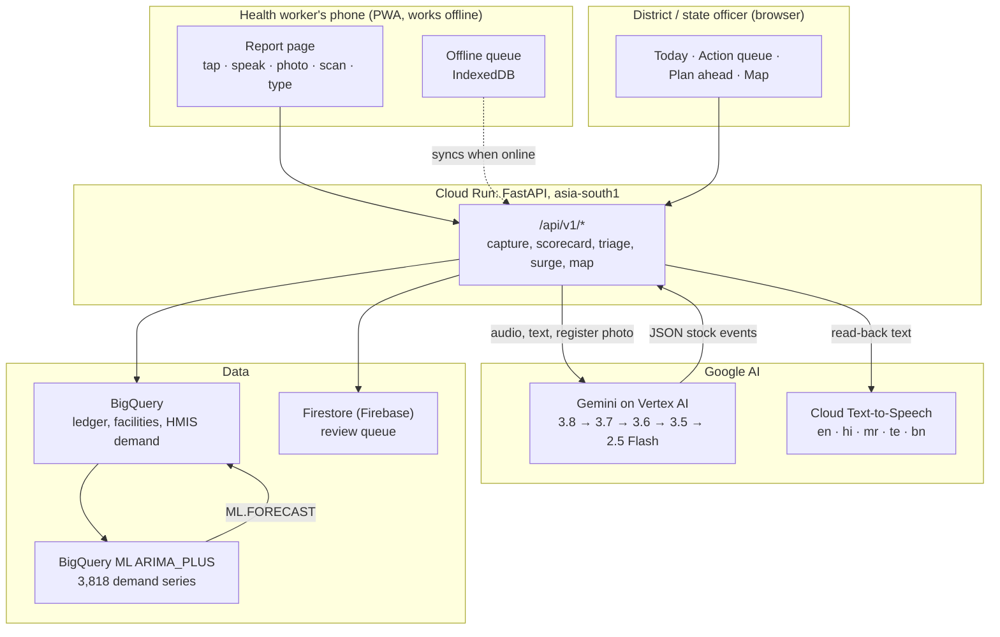

# Architecture

StockPulse is one FastAPI service on **Cloud Run** that serves the web app and
its API, calls **Gemini on Vertex AI** to read reports and write escalation
notes, keeps the stock ledger and the forecasting model in **BigQuery**, and
holds reports awaiting review in **Firestore** (Firebase). Everything runs in
the Google Cloud project `daysupply`, region `asia-south1` (Mumbai).

The diagram's source is [`architecture-google-cloud.html`](architecture-google-cloud.html). The data behind it is listed in [`DATA_SOURCES.md`](DATA_SOURCES.md).

## How one report travels

1. **Capture.** The worker taps, speaks, photographs the stock register, scans
   a barcode or types. Voice arrives as the phone's own audio format; photos
   are shrunk to 1600 px on the phone first.
2. **Gemini reads it** (`app/capture.py`). The system instruction in
   `prompts/extraction_system.txt` turns speech, text or a photographed page
   into JSON: medicine as spoken, event, quantity, confidence. The model is
   called through Vertex AI as the service's own identity: no API key. It is
   never asked for a drug code.
3. **Matched and gated** (`app/capture_pipeline.py`). Names are matched
   server-side against all 385 medicines of the National List. Anything below
   0.6 confidence, unmatched, or taking more off the shelf than the ledger
   holds goes to the review queue in Firestore.
4. **Read back** in the worker's language by Cloud Text-to-Speech
   (`app/speech.py`). Nothing is written until the worker says yes.
5. **Written** to the BigQuery ledger `resource_events`. Stock positions,
   reorder points and every page read from views over it, so a report moves
   the numbers within seconds.
6. **Forecast and act.** BigQuery ML ARIMA_PLUS forecasts demand per centre
   and medicine; the reorder point is `μ × L + 1.65 σ √L` with L from
   BigQuery GIS straight-line distance. Shortages are split into transfer, order or
   escalate, and Gemini drafts the escalation note from the row's own figures
   (`prompts/escalation_note_system.txt`), with every number checked.

## Google Cloud services

| Service | What it does here | Code |
|---|---|---|
| Cloud Run | Hosts the web app and API, one warm instance | `Dockerfile`, `app/main.py` |
| Vertex AI, Gemini Flash | Reads voice, text and register photos; drafts escalation notes | `app/capture.py`, `app/brief.py`, `prompts/` |
| Cloud Text-to-Speech | Speaks every read-back in five Indian languages | `app/speech.py` |
| BigQuery | The stock ledger, facility register, HMIS demand, all views | `app/bq.py`, `ingestion/` |
| BigQuery ML | ARIMA_PLUS demand forecasting, 3,818 series | `ingestion/train_forecast.py`, `app/forecast.py` |
| BigQuery GIS | Distance to district headquarters, transfer radius, the map | `ingestion/set_lead_times.py`, `app/mapview.py` |
| Firestore (Firebase) | Review queue and audit copy of every capture | `app/capture_pipeline.py` |

## The models, and where they run

The chain is in `prompts/models.json`, newest Flash first. Each call has a
25-second timeout and moves to the next model if it fails; a retired model is
skipped at once. Gemini 3 models run at thinking level `low`: a stock report
needs little reasoning, and it keeps a report to about three seconds.

| Order | Model | Vertex AI location |
|---|---|---|
| 1 | gemini-3.8-flash | global |
| 2 | gemini-3.7-flash | global |
| 3 | gemini-3.6-flash | global |
| 4 | gemini-3.5-flash | asia-south1 (Mumbai) |
| 5 | gemini-2.5-flash | asia-south1 (Mumbai) |

The three newest models are served by Vertex AI only on the global endpoint.
A state that requires health data to be processed in India can reorder the
file so the Mumbai models come first; no code changes.
